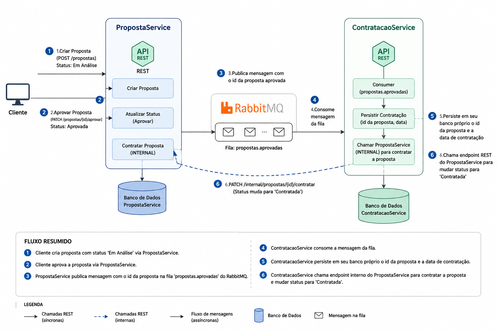
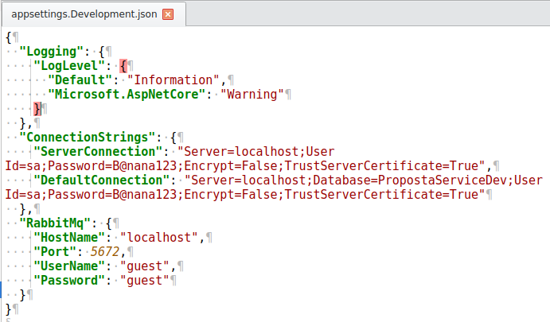
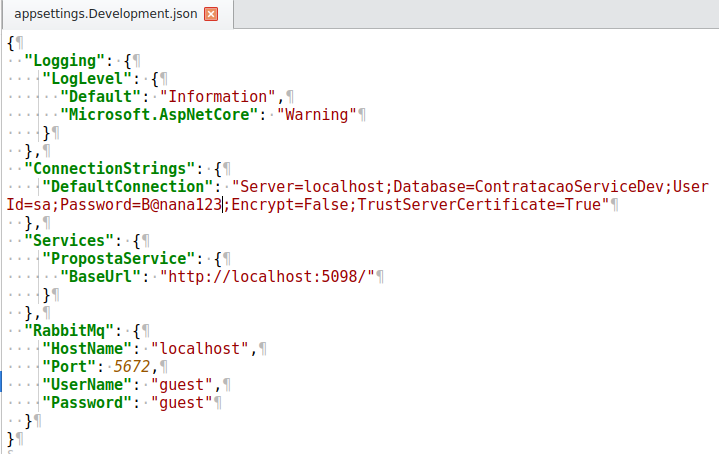

# Teste INDT - Microsserviços .NET com arquitetura hexagonal

## Overview

O cenário proposto foi ter 2 microsserviços, 1 de propostas de seguros e outro, responsável por fazer as contratações quando a proposta estiver aprovada.

## O que o projeto contempla

- RESTful API + Event-Driven usando RabbitMQ
- Arquitetura de código hexagonal (ports and adapters)
- DDD: Proposta e Contratação representam subdomínios dentro do domínio de Seguros. Já PropostaService e ContratacaoService atuam como bounded contexts
- Docker: SQL Server e RabbitMQ containerizados
- Setup dos bancos ao subir PropostaService
- Princípios SOLID
- Clean Code
- Observabilidade com Correlation ID, suporte a logs com Serilog
- Middleware para tratamento global de exceções + Result Pattern
- Repository pattern + EF Core e Dapper
- Testes automatizados (unitários e de integração)

## Fluxo:

1. A proposta é criada via endpoint REST em PropostaService com status 'Em Análise'.
2. Outro endpoint permite atualizar o status da proposta para 'Aprovada'.
3. Ao fazer a aprovação, é enviada mensagem com id da proposta a uma fila do RabbitMQ.
4. ContratacaoService consome a mensagem dessa fila.
5. Ao consumir a mensagem, ele persiste em banco próprio o id da proposta e data da contratação.
6. Faz chamada em outro endpoint "interno" de PropostaService pra efetivar a contratação da proposta (status 'Contratada').

<br>



## Ferramentas

Docker<br>
SQL Server containerizado<br>
RabbitMQ containerizado

## Instruções Gerais

1o: subir containers (docker-compose.yaml na raiz do repo).

```docker compose up -d```

<br>

**Build das aplicações**

Entrar nas pastas das 2 solutions e

```dotnet build -c Release```

<br>

**Execução**

PropostaService: entrar na pasta Indt.Teste.PropostaService\src\Indt.Teste.PropostaService.Api

ContratacaoService: entrar na pasta Indt.Teste.ContratacaoService\src\Indt.Teste.ContratacaoService.Api

```dotnet run```

<br>

**Sequência**

Rodar 1o PropostaService. Ao rodar a aplicação pela primeira vez, ela irá conectar ao SQL Server e fazer o setup inicial (criar bancos, tabelas, seed). De toda forma, os scripts foram deixados em /db-scripts do repo.

Se estiver em ambiente de desenvolvimento, os bancos serão criados com sufixo Dev.
Ao rodar testes de integração em PropostaService, o banco terá o sufixo Test.

Atenção aos appsettings.json para conexões.

### PropostaService



### ContratacaoService


